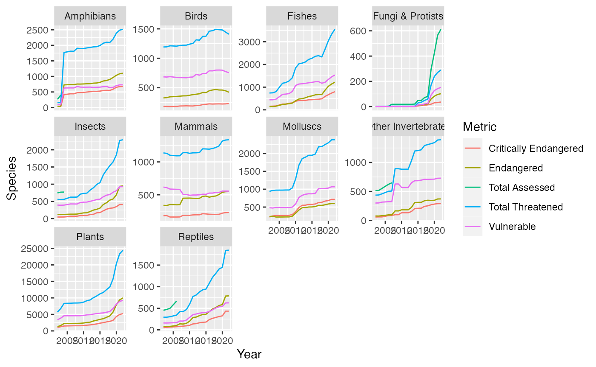

# ProjectDataViz

<!-- badges: start -->
<!-- badges: end -->

To look at two datasets and seeing the trends that form from the early 2000's to present day on how much a species has been impacted to the verge of endangerment

## Why this dataset 

I had analyzed this dataset as I was interest in learning which species were threatened in becoming extinct due to us as human causing damage to a species environment.

## from dataset

This dataset is showing how 9 out of the 10 species are threatned of endangerment due to human mismangment

## about the author
Owner of the package: Davinder Singh, UC Merced alumni
